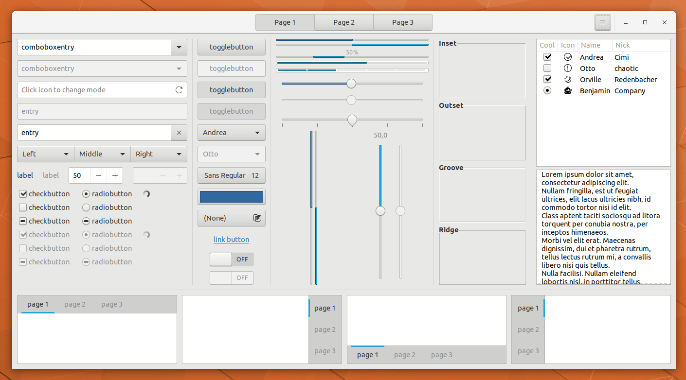
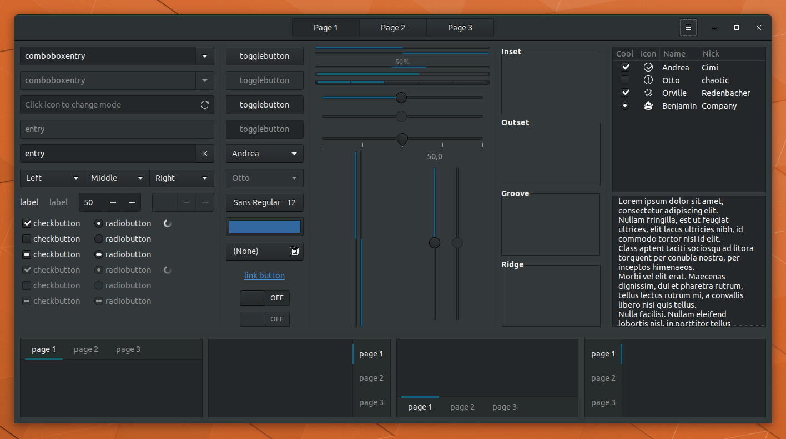
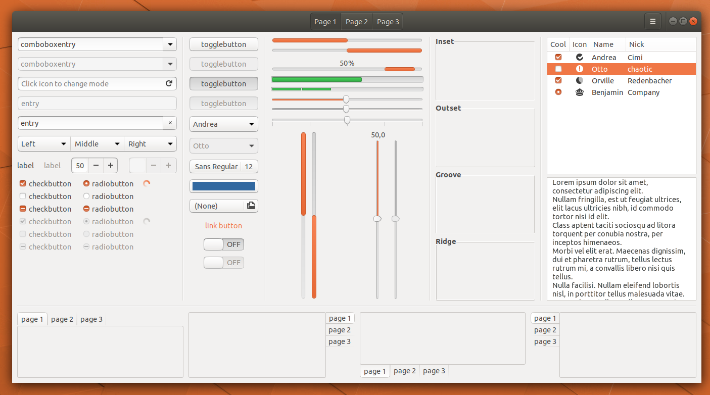
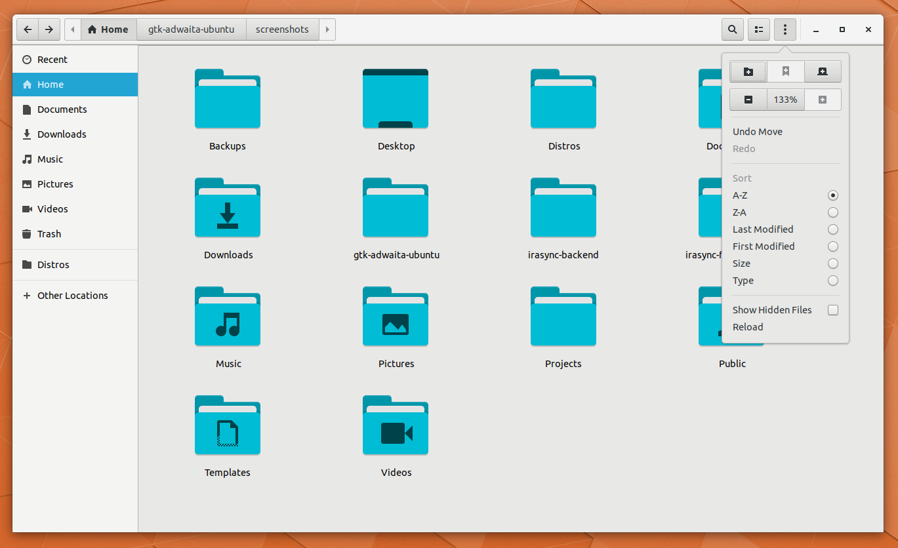
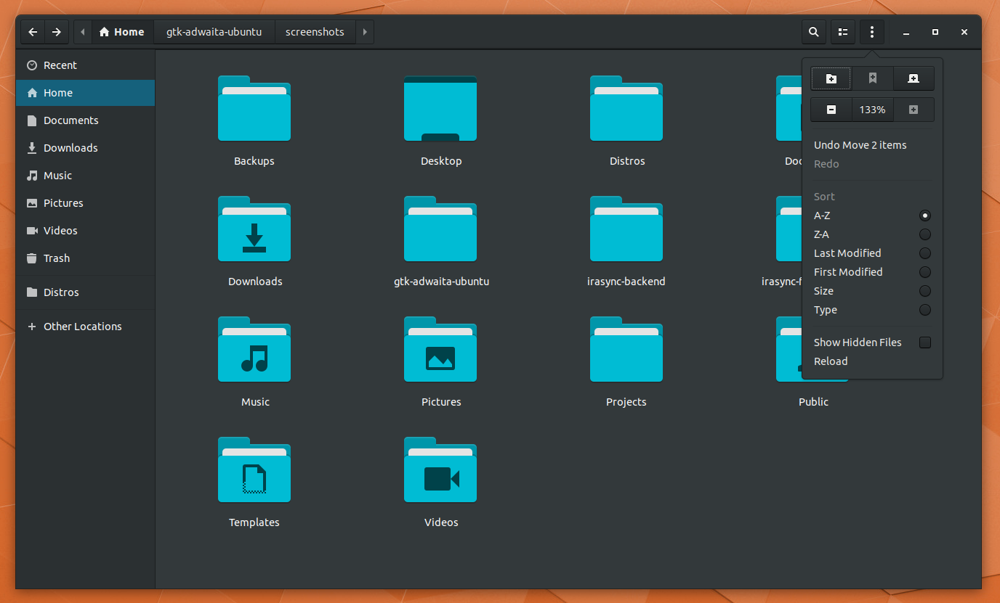
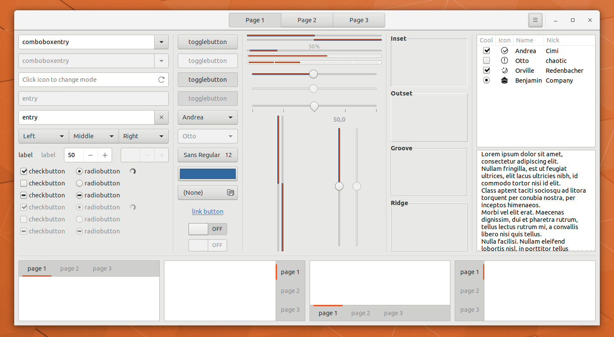
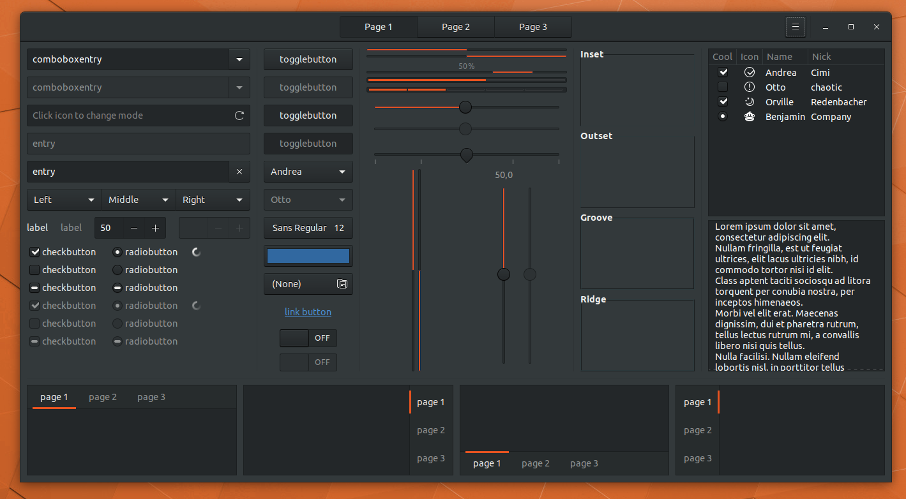
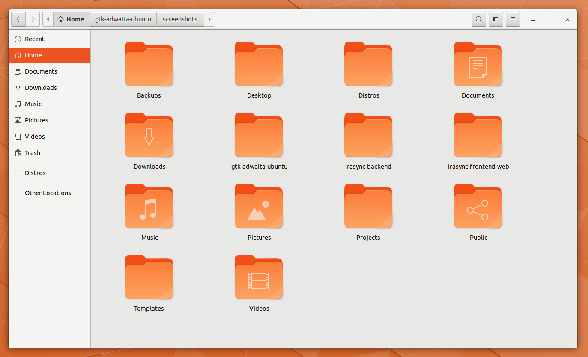
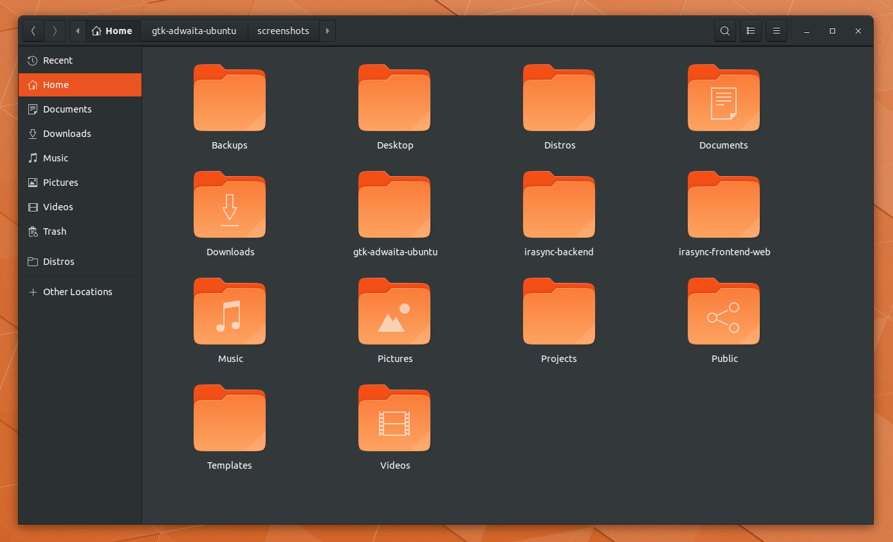

# We are have moved to [a new repository](https://github.com/pojntfx/adwaita-gtk-ubuntu)!

# Ubuntu LTS 18.04 Unofficial Adwaita GTK Theme Evaluation

> To test out whether it may be a better idea to use Adwaita instead of Ambiance in LTS if Communitheme won't be done in time. Adwaita has a more modern codebase and, in my experience, is prefered over the now 8-year-old Ambiance. See the Screenshots below for a comparison. This uses the build system of an early version of the [Ubuntu GTK Communitheme](https://github.com/Ubuntu/gtk-communitheme).

## What has been changed from upstream Adwaita?

- The colors used in [Unity8](https://docs.google.com/presentation/d/1FtHFW67ycl6uvxZqKIZwyinVyOuV9NxXDuJv1SwQ70k/edit#slide=id.g13b3c671fc_1_0) have been applied to buttons and other elements. Nothing more than that.
> The goal is to keep this is as maintainable as possible, so no big edits here. The first variant uses the Unity8 light blue color as the main highlight color.

## Where is the shell theme?

> Will be added soon. Until then, using the upstream Adwaita one with the Ubuntu typeface should be fine.
> If you are using Communitheme and dash to dock, follow the instructions in ./addons/gnome-and-dash-to-dock.css to use a beta of it!

## What icon theme should be used?

That depends on the variant you want to use. Unity8 versions work well with the stock Papirus-Adapta (See screenshots below) theme, but I will create probably create a version of the Adwaita icon theme that uses the folder icons of the theme variant. If you're using the orange version, the Suru icon theme works nicely. A suru icon theme with Unity8 folder icon colors is currently also [being worked on](https://github.com/pojntfx/suru-icon-theme).

## How do I use the different variants?

> Uncomment the line with the variant you want in the ./Adwaita-Ubuntu/gtk-3.0/_colors.scss file. Available are:
- Unity8 light blue selection color (#23A5D4)
- Unity8 dark blue selection color (#335280)
- Unity7 orange selection color (#E95420)

## Screenshots

> May be outdated. Check out the [Ubuntu Community Hub Thread](https://community.ubuntu.com/t/adwaita-theme-with-unity8-colours-and-other-variants/4041) for mockups etc.

### GTK3 Widget Factory (Light/Dark Version with the light blue Unity8 accent as the primary color)





### GTK3 Widget Factory (Ambiance for comparison)



### Nautilus (Light/Dark Version with the light blue Unity8 accent as the primary color)





### GTK3 Widget Factory (Light/Dark Version with the orange Unity7 accent as the primary color)





### Nautilus (Light/Dark Version with the orange Unity7 accent as the primary color)





## Build Setup

> You will need to have the ```sassc``` package installed in order to compile this.

```bash
meson build --prefix=/usr
cd build
sudo ninja install
```

## Recompile after changes

```bash
sudo ninja install
```

> After running the above in the build folder, press <kbd>Alt + F2</kbd>, then type 'rt', then press <kbd>Enter</kbd> to apply the theme. Use GNOME Tweaks to apply the theme and the GTK Inspector to switch between the light and dark variants of it. It also enables you to quickly test out changes.

## What wallpapers?

Ubuntu Community Hub user [nusi](https://community.ubuntu.com/u/nusi/summary) created two beautiful variants of the default Adwaita background, they can be found in ./wallpapers/ in this repo. They can be seen below.


